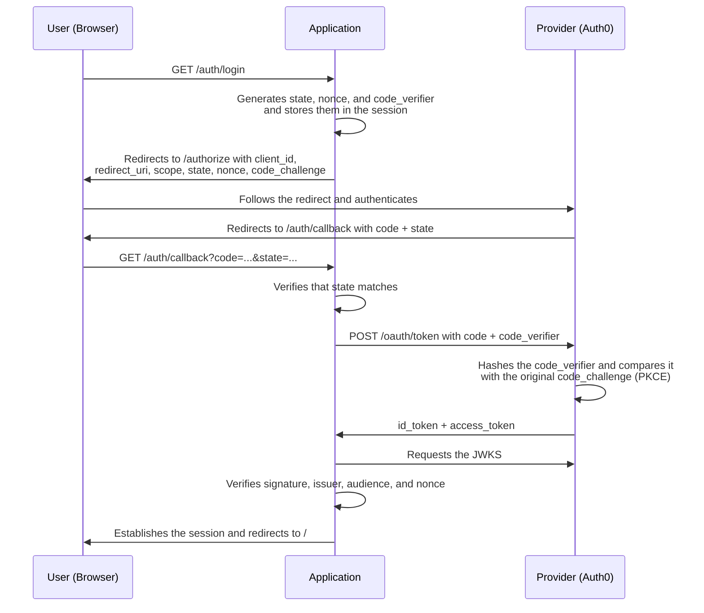

# OIDC implemented from scratch

An OpenID Connect client built by hand, without using any OIDC or OAuth library, with the goal of understanding what actually happens during a login with an identity provider like Google.

"Sign in with Google" buttons hide a flow with several stages: redirects, token exchanges, and a set of parameters whose purpose is not always obvious. This project reconstructs that flow step by step, instead of delegating it to an SDK that abstracts it away.

It is not intended as a production solution. It is a learning project, and its value lies less in the code than in the understanding of the protocol documented below.

## Overview

This is a minimal Node.js server, written in TypeScript with Express, that acts as a client application in front of an identity provider. It uses Auth0, though the procedure is equivalent to what would be followed with Google, GitHub, or Okta.

The implementation follows the *Authorization Code Flow with PKCE*, the flow currently recommended for web applications. It consists of three routes:

- `/auth/login` builds the authorization request and redirects to the provider.
- `/auth/callback` receives the code, exchanges it for tokens, verifies them, and establishes the session.
- `/auth/logout` destroys the local session and also logs out from the provider.

## What I learned

### The relationship between OIDC and OAuth 2.0

The first concept that became clear is that OIDC is an authentication layer built on top of OAuth 2.0. Although they are often mentioned interchangeably, they solve different problems:

- OAuth 2.0 answers the question "does this application have permission to access these resources?" and issues an `access_token`.
- OIDC answers "who is this user?" and adds the `id_token`, a signed JWT containing the person's identity: `sub`, email, name, and other claims.

In other words, OIDC does not define a new protocol; it reuses the entire OAuth flow and adds the `id_token` along with the rules needed to verify it. Understanding that distinction removed most of the initial confusion.

### What happens when logging in

I used to assume the button authenticated the user automatically. In reality, clicking it makes the application build an authorization request and redirect the user to the provider with a series of parameters, each with a specific purpose:

- `client_id` identifies the application to the provider.
- `redirect_uri` indicates where the user should return to after authenticating. It is registered in advance to prevent a third party from redirecting the flow elsewhere.
- `scope` defines the requested information. `openid` is what activates OIDC; `profile` and `email` request that additional data.
- `response_type=code` indicates that a temporary code is expected instead of the token itself.
- `state`, `nonce`, and `code_challenge` correspond to the flow's three security mechanisms.

The user authenticates on the provider's domain — the application never has access to their password, an important detail I had not considered before — and is then redirected back to the `redirect_uri` with a single-use `code`.

### The `state` parameter

`state` is a random string generated when the login starts, stored in the session, and sent with the request. When the user returns to the callback, the provider returns that same `state`, which is compared against the stored value. If they do not match, the process is stopped.

Its purpose is to guarantee that whoever started the login is the same person being redirected back. Without this check, an attacker could inject their own `code` into another person's session — a CSRF attack — and the application would accept it, having no way to verify that the callback originated from a flow it actually started.

### PKCE

This mechanism best illustrated the principle of not trusting the communication channel. PKCE works as follows:

1. When the login starts, a `code_verifier` is generated: a secret random string that stays on the server.
2. Its SHA-256 hash, called the `code_challenge`, is computed, and only that value travels in the public authorization request.
3. When exchanging the `code` for tokens, the original `code_verifier` is sent.
4. The provider applies the same hash and checks that it matches the `code_challenge` received at the start. If it matches, it issues the tokens.

The key point is that PKCE ties the initial request to the code exchange. Even if an attacker intercepted the `code`, they could not use it, since they do not know the `code_verifier` — that value never travels over the network, only its hash does. It is analogous to sending the lock at the beginning and proving at the end that you hold the key that opens it.

It is worth noting that the `S256` method is used — SHA-256 encoded in base64url — precisely so that what is publicly exposed is the hash, not the secret.

### The `nonce` parameter

In addition to `state`, a `nonce` is sent, which the provider embeds inside the `id_token`. Upon receiving the token, the `nonce` it contains is checked against the one originally generated.

At first it seemed redundant with `state`, but it is not: `state` protects the redirect, while `nonce` protects the token. The latter prevents an old or stolen `id_token` from being reused — a replay attack. These are independent layers against different threats.

### Token verification is mandatory

This is where I corrected a conceptual error: I believed that receiving the `id_token` was the end of the process. It is not. A signed JWT must not be trusted automatically — it must be verified. Specifically, four elements are checked:

- The signature, validated against the provider's public keys. These are published at a standard endpoint (`/.well-known/jwks.json`, known as the JWKS), which confirms that the token has not been tampered with and was indeed issued by the provider.
- The `issuer`, to ensure it was issued by the expected provider.
- The `audience`, to confirm the token is intended for this application's own `client_id` and not another one.
- The `nonce`, to verify it corresponds to this specific request.

Only once all these checks pass is the user considered authenticated and their data stored in the session.

### The complete flow

With all the pieces in place, the full flow is represented as follows:



## On the stack

The project is written in TypeScript to type the token response, the claims, and the session, which makes it easier to reason about the flow. It uses Express 5 as the server and `express-session` to keep `state`, `nonce`, `code_verifier`, and the user across redirects.

The cryptographic logic is implemented by hand in [`src/helpers/crypto.ts`](src/helpers/crypto.ts): `randomBytes` for secret values and `createHash` for the PKCE `code_challenge`, both from `node:crypto`.

The one exception is [`jose`](https://github.com/panva/jose), used exclusively to verify the JWT's signature against the JWKS. It would have been possible to implement that part by hand as well, but doing it correctly — JWKS parsing, algorithm handling, key rotation — amounts to reimplementing sensitive cryptography, which in security matters is better left unhandcrafted. The rest of the protocol is written step by step.

```
src/
├── index.ts              server, session, and root page
├── routes/auth.ts        login, callback, and logout: the core of the flow
└── helpers/crypto.ts     randomString and pkceChallenge
types/
└── express-session.d.ts  session types
```

## Running it

Node.js `v24.18.0` is required (specified in [`.nvmrc`](.nvmrc)), along with pnpm and an application registered in Auth0 or the provider of choice.

Install dependencies:

```bash
pnpm install
```

Then create a `.env` file at the root (included in `.gitignore`, so it is not versioned):

```bash
AUTH0_DOMAIN=your-tenant.us.auth0.com
AUTH0_CLIENT_ID=your_client_id
AUTH0_CLIENT_SECRET=your_client_secret
AUTH0_REDIRECT_URI=http://localhost:3000/auth/callback
SESSION_SECRET=a_long_random_string
PORT=3000
```

In Auth0, register `http://localhost:3000/auth/callback` as an Allowed Callback URL and `http://localhost:3000` as an Allowed Logout URL.

Finally, start the server in development mode:

```bash
pnpm dev
```

Opening `http://localhost:3000` and logging in will display the `id_token` claims on the page after authentication.

## Scope

Being a learning project, several aspects that a production client should harden were deliberately left out: the session is kept in memory and would be lost on server restart; cookies should be configured with `Secure`, `HttpOnly`, and `SameSite` over HTTPS; token expiration and renewal are not handled; and error handling is minimal. None of that was the goal. The goal was to understand the protocol, and in that respect it served its purpose.
